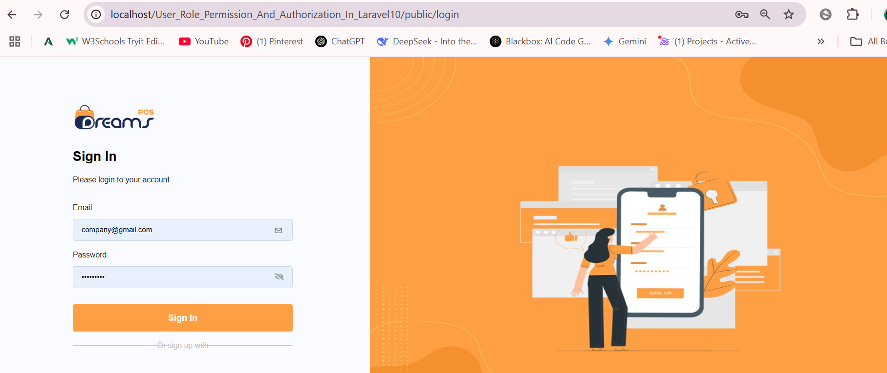
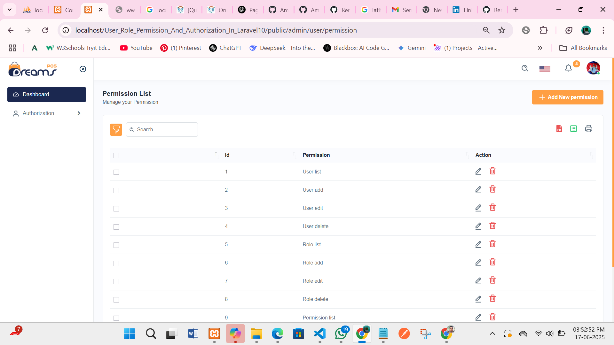
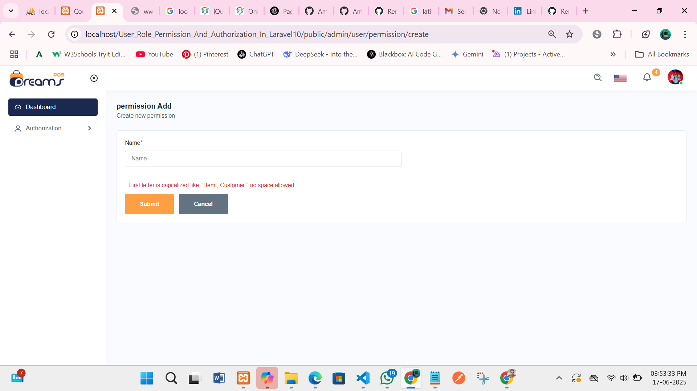

# User Role and Permission with Spatie – Laravel Application

### Admin Login

### User List

### Add User

### User Edit

### Role List

### Role Add

### Role Edit

### Permission List

### Permission Add

### Permission Edit

This is a simple and powerful user role and permission system built with **Laravel** using the **Spatie** package. It allows you to manage users, roles, and permissions easily.

## 🚀 Features

- ✅ User Management (Add, Edit, Delete)
- ✅ Role Management (Add, Edit, Delete)
- ✅ Permission Management (Add, Edit, Delete)

## 🛠️ Built With

- Laravel 10
- PHP 8.x
- MySQL
- Bootstrap 5
- JavaScript / jQuery
